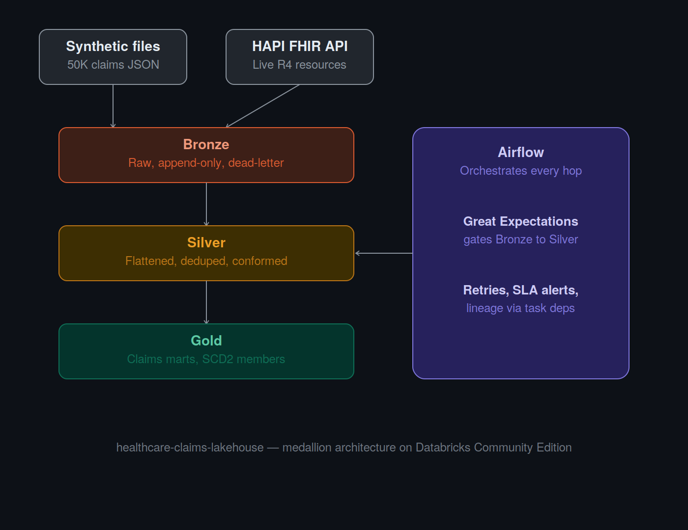

# healthcare-claims-lakehouse
Production-grade PySpark + Delta Lake healthcare claims platform on Databricks. Companion project to concord-payer-interop.

## Architecture

Two ingestion sources (batch files + live FHIR API) land in Bronze (raw, append-only, dead-letter isolated). Great Expectations gates promotion to Silver (flattened, deduped, conformed schema). Gold hosts business-ready marts (incremental fact tables, SCD2 dimensions). Airflow orchestrates every hop, handles retries, and enforces SLAs.
